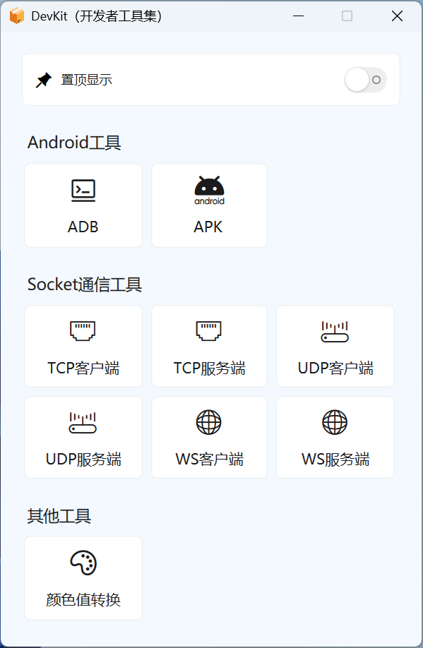
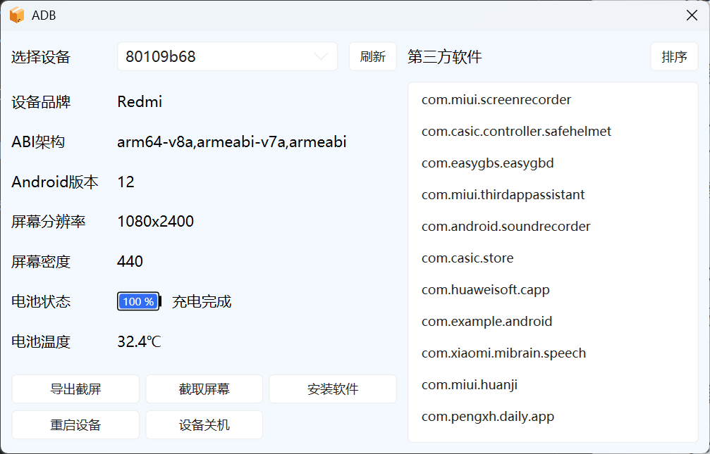
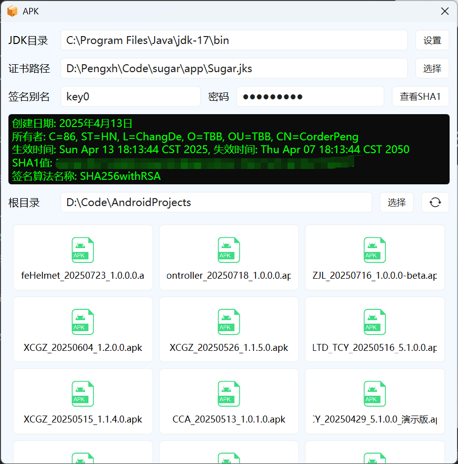
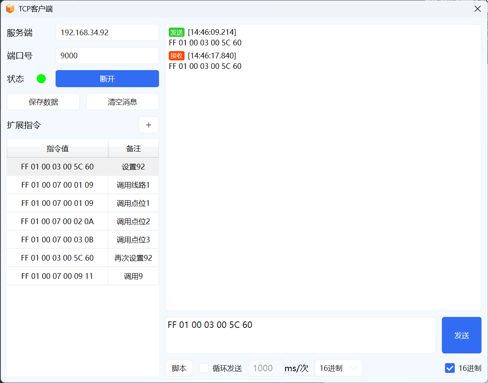
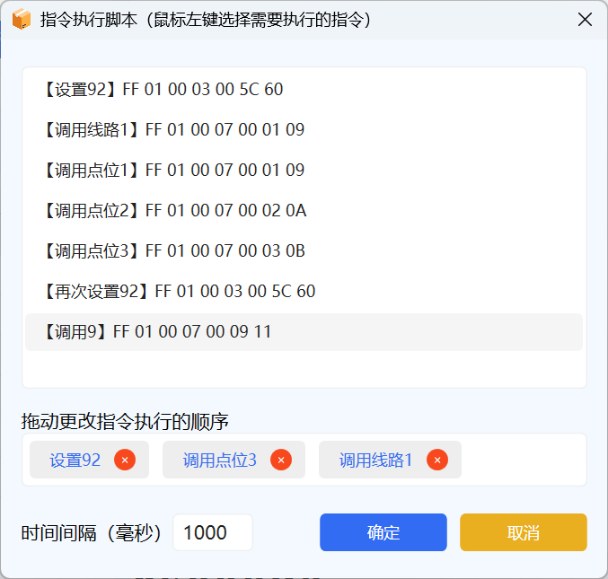
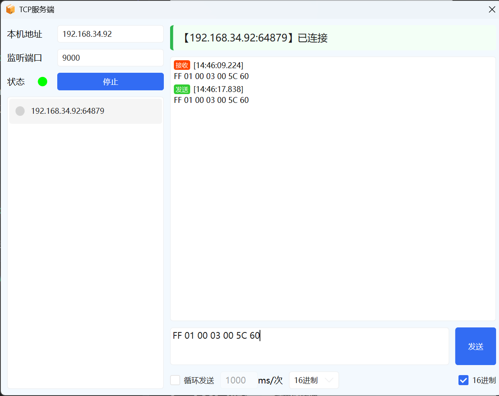
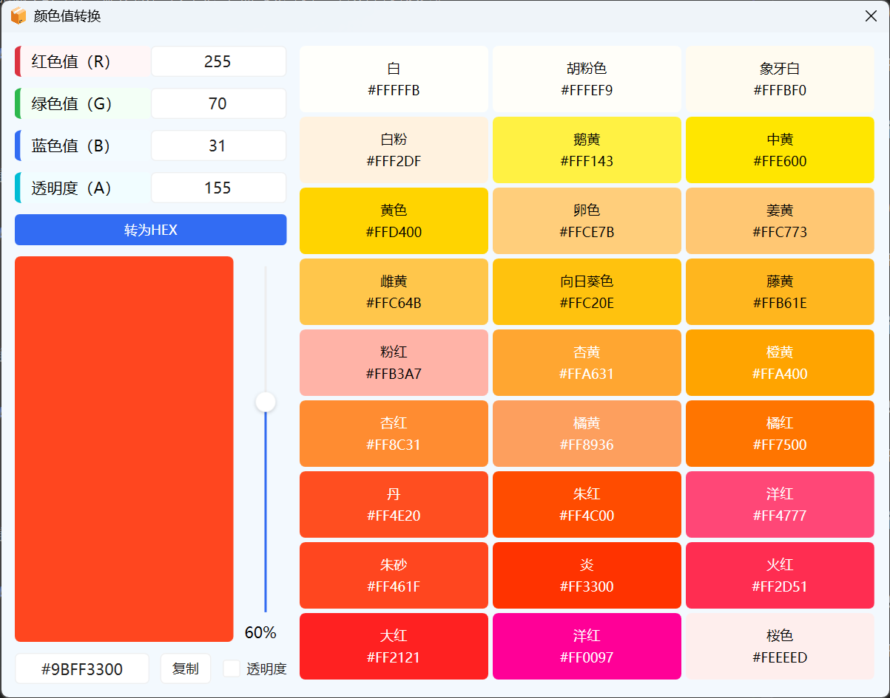

# DevKit

软件开发常用工具整理：[下载地址](DevKit.zip)

暂时分为三个大模块：

1. Android
2. Socket
3. 其他

主界面长这样：

## Android工具

## 1. ADB

具体细节功能就不展示了，每个按钮已经很清楚的表明了它的功能。另外，卸载软件，在右侧列表右键软件包名即可

## 2. APK

* 设置好JDK和 *jks 文件路径即可方便的查看SHA1值，对于Android开发者来说，涉及到地图相关必定需要查看自己软件的SHA1值，以前我每次都是敲命令去查看，次数多了就烦了，干脆写了个工具。
* 另外，还能帮你检索指定目录下所有的apk安装包，鼠标左键点击检索出来的apk即可快速打开它所在的文件夹目录，非常方便！

## Socket工具

## 1. TCP客户端

* TCP功能就不写说了，会的都会，输入IP和端口号，然后点击连接，输入要发送的数据，点击发送，数据发送成功后，会自动显示接收到的数据。
* 脚本里面可以设置要发送指令的顺序以及间隔（左键可以拖动指令发送的顺序）。
  

## 2. TCP服务端

TCP服务端功能简单，打开监听即可，要给哪个客户端回消息，选择左边客户端列表即可，就跟微信聊天差不多。另外，本软件的的TCP客户端和TCP服务端可以相互通信，它俩互不干扰。

## 3. UDP客户端

功能跟TCP客户端类似，只不过不需要连接，可以直接发送。

### 附图：略

## 4. UDP服务端

功能跟TCP服务端一样。

### 附图：略

## 5. WebSocket客户端

功能跟TCP客户端一样。

### 附图：略

## 6. WebSocket服务端

功能跟TCP服务端一样。

### 附图：略

## 其他工具

涵盖中国传统颜色值们可以方便的将ARGB颜色值转为HEX颜色值，对位任何语言的开发者来说，应该都有很大帮助。

`最后：如果我的这个工具在开发上帮助了你，希望能star一下~~~，我也会时常更新其他常用的工具~`